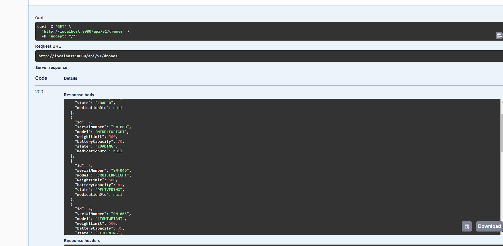
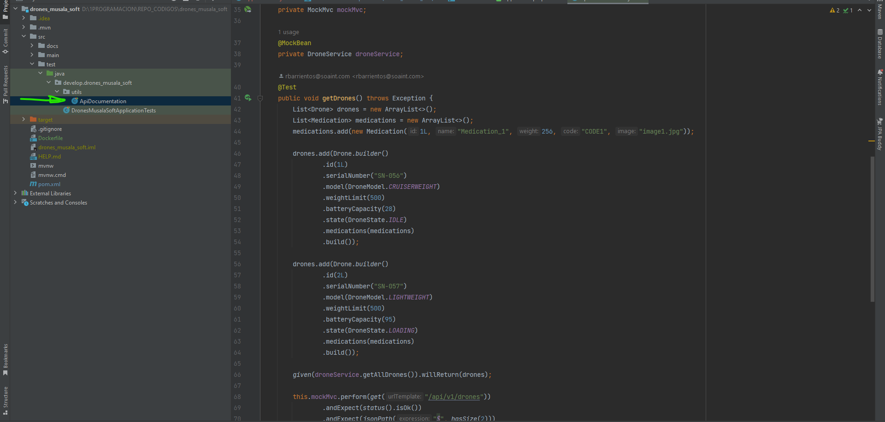

# Drones API MUSALA SOFT
The developed application corresponds to an API service, which exposes REST services, through RESTFUL technology.
For the same, Spring Boot was used in its version: 3.1.0 and OpenJDK version: 17.0.2.
The H2 Database Engine was used as the test database, in which the data persistence was performed in memory in test form (jdbc:h2:mem:testdb).
Once the application is started, the database can be accessed using the url:
http://localhost:8080/h2-console/login.jsp

The data preload for the database is done through the DataLoader class, which creates 10 drones and 50 drugs with random data.
You can run the application directly with **`.mvn clean spring-boot:run`** or build the docker image and run it in docker.

For unit tests JUnit and Mockito were used.
For the documentation, Spring REST Docs and OpenAPI were implemented with Swagger.
The documentation generated with Spring Rest Docs can be consulted in the path: target/generated-docs. To do this you must first run mvn prepare-package
To consult the documentation of the API with Swagger access:
http://localhost:8080/swagger-ui/index.html



To consult the API documentation with OpenAPI:
http://localhost:8080/api-docs




# Run

```
mvn clean spring-boot:run
```
# Build image

`mvn clean install`


# Run with Docker
```
docker build -t drones-api-musala .
```

```
docker run -d  -p 8080 : 8080 --name drone-service-musala drones-api-musala
```

Data Base Config:

Driver Class: org.h2.Driver

JDBC URL: jdbc:h2:mem:testdb

User Name: sa

No password

